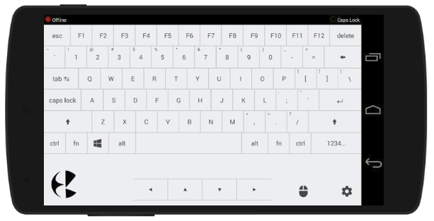
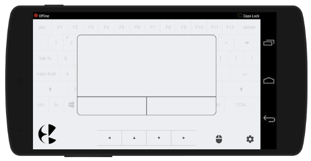
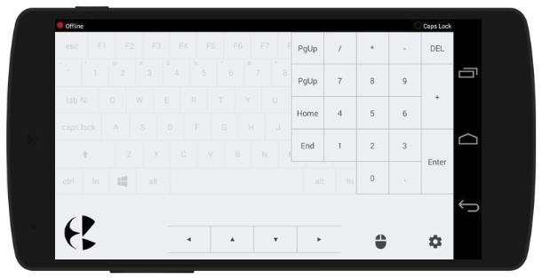

## Kb PC Client

This is a **client side windows console application** for an android app **Kb-The Soft Keyboard**. The Android App provides a **wireless keyboard/mouse interface** for the Windows operating system.

### How to use:

1. First of all, install Kb (the android app) on your android device. The app is available on Google Play Store. The link is given below.
2. Download the zip file, named **Kb PC Client** from _releases page_ of this repository and run the .exe file on your windows PC.
4. The android device and the PC must be connected to the same network. For example, if you are using a wireless network then the device and PC must be connected to that wireless network.
3. On running the .exe file, a console application opens up on the PC which will display the **IP Address** which is used to connect your android app to your PC.
4. Open Settings page in Kb android app, and enter the IP address to connect.
5. On successful connection, console will display the success message.
6. Please do not close the console client while your device is connected to it. Although you may minimize it in the background.

### Screenshots of the Kb Android App

