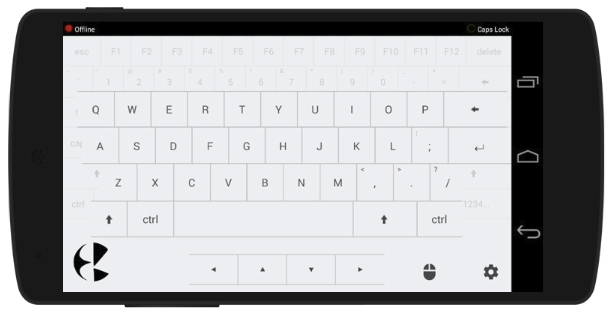

## Kb PC Client

This is a **client side, windows console application** for an android app **Kb-The Soft Keyboard**. The Android Application provides a **wireless keyboard/mouse interface** for a windows operating system.

### How to use:

1. First of all, install Kb (the android application) on your android device. The application is available on Google Play Store. The link is given below.
2. Download the zip file, named **Kb PC Client** from _releases page_ of this repository and run the .exe file on your windows PC.
3. On running the .exe file, a console application opens up on the PC which will display the **IP Address** which is used to connect your android app to your PC.
4. Open the Settings page of Kb android app, and enter the IP address to connect.
5. On successful connection, console will display the success message.
6. Please do not close the console application while your device is connected to the Client although you may minimize it in the background.

### Screenshots of the Kb Android App

